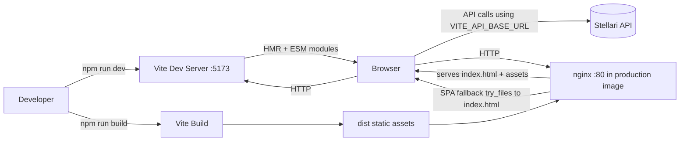

# Stellari Web

Main Stellari web application: public website, product entry, and in-app web surfaces.

This repo powers the primary web presence for Stellari, including landing pages and informational pages (for example About Stellari), and provides the login entry point into the product app.

After login, this web app also includes:

- Admin dashboard and staff-facing admin pages.
- Participant-facing pages such as reward scan flows.
- Participant and parent/user interaction pages.

## Purpose

This repository contains only the frontend app.

- Build Stellari's public web experience (landing and informational pages).
- Provide the login gateway that routes authenticated users into the product app.
- Support authenticated product experiences for different user roles.
- Deliver admin interfaces for staff users and operational workflows.
- Deliver participant/parent pages for rewards and day-to-day interactions.
- Connect to API services through `VITE_API_BASE_URL`.
- Provide both local dev workflow and containerized workflows.

## Quick Start

### Option 1: Local Node workflow (fastest for UI development)

```bash
npm install
npm run dev
```

App runs at `http://localhost:5173`.

### Option 2: Docker workflow (consistent team environment)

```bash
docker-compose up -d
docker-compose logs -f web
docker-compose down
```

This runs the Vite dev server inside a container with hot reload.

## Frontend Architecture

### High-level flow

1. Browser requests the app.
2. In development, Vite serves modules directly with HMR.
3. In production, nginx serves prebuilt static assets from `dist`.
4. React renders the UI and calls API endpoints using `VITE_API_BASE_URL`.

### Components and responsibilities

- **React 19**
	- UI rendering layer.
	- Component composition and app state.

- **TypeScript**
	- Compile-time safety for components, data contracts, and utility logic.

- **Vite**
	- Dev server for local iteration (`npm run dev`).
	- Build tool for production assets (`npm run build`).
	- Preview server for local production check (`npm run preview`).

- **nginx**
	- Yes, nginx is used in the production container path.
	- It serves static files generated by Vite from `/usr/share/nginx/html`.
	- `try_files $uri $uri/ /index.html;` enables SPA routing so client-side routes work on refresh.
	- nginx is **not** used in normal local `npm run dev`; Vite handles that path.
	- In this repo, nginx is a static web server, not an app runtime. React code is already compiled to JS/CSS before nginx sees it.

### nginx Deep Dive

#### Why nginx in production

1. It is lightweight and efficient for serving static assets.
2. It handles high request volume well for JS/CSS/image delivery.
3. It gives predictable behavior in containerized deployments.
4. It cleanly supports SPA fallback routing.

#### How request handling works

1. Browser requests a path (for example `/`, `/about`, `/rewards/scan`).
2. nginx checks whether a matching file exists in `/usr/share/nginx/html`.
3. If it exists, nginx serves the file directly.
4. If it does not exist, nginx serves `index.html` via `try_files ... /index.html`.
5. React Router (or your client router) then resolves the route in the browser.

This is why deep-link refreshes on client-side routes continue to work.

#### What nginx does not do here

1. It does not run TypeScript or React source files.
2. It does not bundle code (Vite build does that before runtime).
3. It does not replace the API backend.
4. It does not handle local dev HMR flow (Vite dev server does that).

#### Development vs production behavior

- Development (`npm run dev` or `docker-compose` with `Dockerfile.dev`): Vite serves the app with HMR.
- Production image (`Dockerfile`): Vite builds static files, then nginx serves those files on port 80.

#### Current nginx config in this repo

- `listen 80;` exposes HTTP inside the container.
- `root /usr/share/nginx/html;` points to built static assets.
- `index index.html;` sets default entry file.
- `location / { try_files $uri $uri/ /index.html; }` enables SPA route fallback.

If needed later, this config is where to add cache headers, gzip/brotli, security headers, or reverse-proxy rules.

- **Dockerfile.dev**
	- Development container using Node.
	- Runs Vite with host binding so browser access works from the host machine.

- **Dockerfile**
	- Multi-stage production image:
		- Stage 1: Node builds assets.
		- Stage 2: nginx serves built assets.

- **docker-compose.yml**
	- Web-only local container orchestration for this repo.
	- Mounts source for hot reload and exposes port `5173`.

## Architecture Diagram



### Diagram Notes

1. Development path uses Vite directly (no nginx).
2. Production path serves built static files through nginx.
3. The browser talks to the backend API via `VITE_API_BASE_URL` in both modes.

## Repository Start Points

Use these files when onboarding a new developer:

- `src/main.tsx`
	- Application entry point.
	- Place future global providers here (router, query client, auth provider).

- `src/App.tsx`
	- Starter template screen.
	- First file to replace with real page shell or route layout.

- `src/index.css`
	- Global design tokens and base styles.
	- Update brand colors, fonts, spacing primitives here first.

- `src/App.css`
	- Starter page layout styles.
	- Reuse patterns or replace with feature-specific styles.

- `docker/nginx.conf`
	- Production static serving and SPA route fallback behavior.

## Environment Configuration

Base template:

```bash
VITE_API_BASE_URL=http://localhost:3000
```

Use `.env.example` as reference and create local `.env` files as needed.

## Commands

```bash
# Start dev server
npm run dev

# Type-check + build production assets
npm run build

# Preview built assets locally
npm run preview

# Run lint checks
npm run lint
```

## CSS Direction (Recommended)

1. Keep global design tokens in `src/index.css` (colors, typography, spacing, shadows).
2. Build features with component-level styles (for example: `FeatureCard.module.css`).
3. Use CSS variables for theme consistency instead of hardcoded values in components.
4. Introduce utility-first tooling later only if team velocity clearly benefits.

This keeps styling explicit, scalable, and easier to maintain as the UI surface grows.
